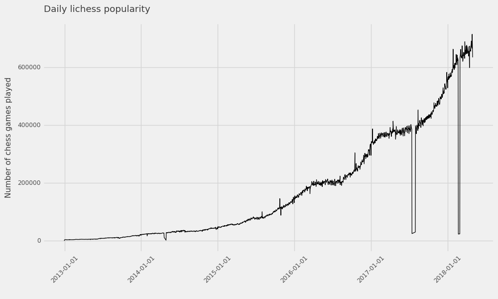
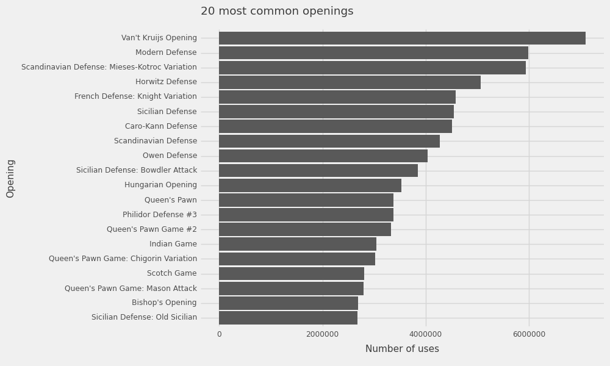

# Lichess database to parquet converter

In this repository, you can find code to convert data from [database.lichess.org](https://database.lichess.org) to a folder with Apache `parquet` files, which can be queried efficiently using [`polars`](https://pola.rs):

```python
import polars as pl
chess_df = pl.scan_parquet("lichess_parquet/*.parquet")
chess_df.head().collect()
```

|    | ID       | UTCDate             | UTCTime   | White            | Black             | Result   |   WhiteElo |   BlackElo |   WhiteRatingDiff |   BlackRatingDiff | ECO   | Opening                                     | TimeControl   | Termination   |
|---:|:---------|:--------------------|:----------|:-----------------|:------------------|:---------|-----------:|-----------:|------------------:|------------------:|:------|:--------------------------------------------|:--------------|:--------------|
|  0 | j1dkb5dw | 2012-12-31 00:00:00 | 23:01:03  | BFG9k            | mamalak           | 1-0      |       1639 |       1403 |                 5 |                -8 | C00   | French Defense: Normal Variation            | 600+8         | Normal        |
|  1 | a9tcp02g | 2012-12-31 00:00:00 | 23:04:12  | Desmond_Wilson   | savinka59         | 1-0      |       1654 |       1919 |                19 |               -22 | D04   | Queen's Pawn Game: Colle System, Anti-Colle | 480+2         | Normal        |
|  2 | szom2tog | 2012-12-31 00:00:00 | 23:03:15  | Kozakmamay007    | VanillaShamanilla | 1-0      |       1643 |       1747 |                13 |               -94 | C50   | Four Knights Game: Italian Variation        | 420+17        | Normal        |
|  3 | rklpc7mk | 2012-12-31 00:00:00 | 23:04:57  | Naitero_Nagasaki | 800               | 0-1      |       1824 |       1973 |                -6 |                 8 | B12   | Caro-Kann Defense: Goldman Variation        | 60+1          | Normal        |
|  4 | 1xb3os63 | 2012-12-31 00:00:00 | 23:02:37  | nichiren1967     | Naitero_Nagasaki  | 0-1      |       1765 |       1815 |        -9 |                 9 | C00   | French Defense: La Bourdonnais Variation    | 60+1          | Normal        |

## Installation and usage

1. Clone or download this repository
2. Install requirements: `pip install -r requirements.txt`
3. `python ingest_lichess.py`

    The command accepts the following arguments:
    + `--start` start year for download (default: 2013)
    + `--end` end year (default: current year)
    + `--months` months to download; list months by number, seperated by spaces (example `--months 1 2 3` for first quarter) (optional; defaults to all months)
    + `--parquet-dir` path to write Parquet-files to (default: `./lichess_parquet`)
    + `--include-moves` whether to include each game's moves in the data (default: False). Take care, this increases the size of the data dramatically.
    + `--debug` display debug info while downloading (default: False)

4. Wait a good while (this results in tens of gigabytes of data!!). To avoid memory problems while downloading, there is a limit of 1M games per Parquet file. Hence, there will be multiple files per year/month (`2023_05_001.parquet`, `2023_05_002.parquet`, etc).

5. Open [`eda.ipynb`](eda.ipynb) and run the code!

## Some plots

The daily number of games played is increasing strongly over the years.


The most popular openings are as follows:



## Contributing

Contributions are what make the open source community an amazing place
to learn, inspire, and create. Any contributions you make are **greatly
appreciated**.

Please refer to the
[CONTRIBUTING](https://github.com/sodascience/lichess_db/blob/main/CONTRIBUTING.md)
file for more information on issues and pull requests.


## License and citation

The package `lichess_db` is published under an MIT license. <!-- When using `lichess_db` for academic work, please cite:

   TODO Zenodo
 -->

## Contact

This project is developed and maintained by the [ODISSEI Social Data
Science (SoDa)](https://odissei-data.nl/nl/soda/) team.


Do you have questions, suggestions, or remarks? File an issue in the issue
tracker or feel free to contact the team via
https://odissei-data.nl/en/using-soda/.
